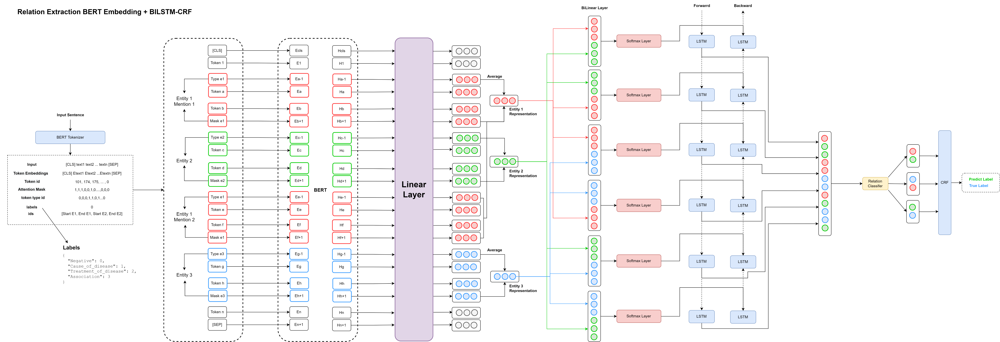
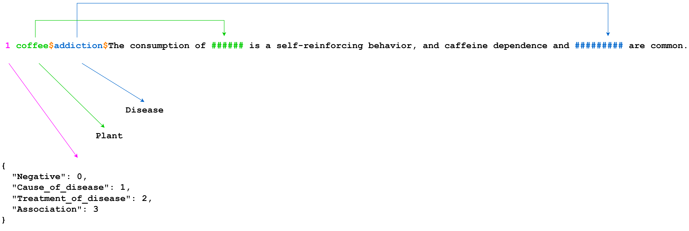

#  **NLP Research**

#  **Relation Extraction in Biomedical using BI-LSTM-CRF model + Bert Embedding + Keras + Tensorflow**

##  **`Slamet Riyanto S.Kom., M.M.S.I.`**

##  **`Dimas Dwi Putra`**

## Architecture
<p align="center"></p>

## Dataset<br>[View Dataset .txt](input/)
<p align="center"></p>

#### Dictionary .json
```yaml
{"Negative": 0, "Cause_of_disease": 1, "Treatment_of_disease": 2, "Association": 3}
```

#### Train Dataset .txt [View Directory](input/)
```yaml
2 Lonicera caerulaea berry$solid tumors$The antioxidant response induced by ######################## extracts in animals bearing experimental ############ . 
1 tobacco$cancer$Targeted smoking prevention and cessation interventions are needed for ###### survivors, especially those diagnosed with a ####### -related ###### . 
0 green tea$pneumonia$OBJECTIVE: We examined the association between ######### consumption and death from ######### in humans. 
...
```

#### Test Dataset .txt [View Directory](input/)
```yaml
1 coffee$addiction$The consumption of ###### is a self-reinforcing behavior, and caffeine dependence and ######### are common. 
0 coffee$coronary disease$Initial trials showing ###### 's association with ################ and myocardial infarction have been difficult to reproduce and have many confounding variables. 
3 coffee$coronary heart disease$BACKGROUND: For many years, an association between ###### consumption and the risk of ###################### has been suspected.
...
```

## Source Code
Utils <br>[View Directory](utils/)
```yaml
- args.py
- att.py
- crf.py
- extract_feature.py
- graph.py
- load_data.py
- modeling.py
- optimization.py
- tokenization.py
```

Notebook<br>
- [BILSTM-CRF-RE.ipynb](BILSTM-CRF-RE.ipynb)<br>
- [BILSTM-CRF-ATTENTION-FC-RE](BILSTM-CRF-ATTENTION-FC-RE.ipynb)

## Visualization
<p align="center">
  
</p>

## Predict<br>[View More Predict Results .xlsx](https://github.com/Dimas263/Django-Websites_NER_RE/blob/master/Data%20kalimat.xlsx)
```yaml
original: green tea#skin papillomas#Inhibitory effect of green tea on the growth of established skin papillomas in mice.
Predict: Treatment_of_disease
```
| sentences                                                                                                                                                                                                                                                                                                                                                                           | status  | plant  | disease | relation      |
| ----------------------------------------------------------------------------------------------------------------------------------------------------------------------------------------------------------------------------------------------------------------------------------------------------------------------------------------------------------------------------------- | ------- | ------ | ------- | ------------- |
| Public awareness about tobacco -related oral cancer is low at present, and new approaches to this problem should include education in the schools on oral cancer, formulation of legislative action to ban the sale of tobacco near schools and colleges, and imposition of societal "barriers" that would make the nonchewing of tobacco socially more acceptable than chewing it. | success | detect | detect  | make relation |
| the mechanism by which magnesium affects digitalis induced arrhythmias was studied in dogs with and without beta receptor                                                                                                                                                                                                                                                           | success | detect | detect  | make relation |
| these observations indicate that oral administration of green tea i p a polyphenol fraction or i p epigallocatechin gallate inhibited the growth and caused regression established experimentally induced skin papillomas                                                                                                                                                           | success | detect | detect  | make relation |
...

## Eval<br>[View Model Report.xlsx](Model%20Report.xlsx)
| Entities              | precision | recall | f1-score | support | processor | ram  | model | batch size | epochs | length | embedding | Uji | excecution time |
| --------------------- | --------- | ------ | -------- | ------- | --------- | ---- | ----- | ---------- | ------ | ------ | --------- | --- | --------------- |
| Negative              | 0.76      | 0.78   | 0.77     | 118     | cpu       | high | 6     | 8          | 71/100 | 512    | 128       | 12  | 5.15.15         |
| Cause Of Disease      | 0.68      | 0.76   | 0.72     | 37      |           |      |       |            |        |        |           |     |                 |
| Treatment Of Diesease | 0.86      | 0.85   | 0.85     | 98      |           |      |       |            |        |        |           |     |                 |
| Association           | 0.50      | 0.12   | 0.20     | 8       |           |      |       |            |        |        |           |     |                 |
| micro avg             |           |        | 0.78     | 261     |           |      |       |            |        |        |           |     |                 |
| macro avg             | 0.70      | 0.63   | 0.63     | 261     |           |      |       |            |        |        |           |     |                 |
| weighted avg          | 0.78      | 0.78   | 0.78     | 261     |           |      |       |            |        |        |           |     |                 |
| F-1 Scores            |           |        | 78,16%   |         |           |      |       |            |        |        |           |     |                 |

## Requirements
install from [requirements.txt](requirements.txt)
```yaml
python==3.6
pandas==0.23.4
keras==2.3.1
termcolor==1.1.0
six==1.16.0
tensorflow==1.13.1
numpy==1.16.2
matplotlib==2.2.4
scikit-learn==0.24.2
h5py==2.10.0
git+https://www.github.com/keras-team/keras-contrib.git
```

# Model Output<br>[View Model Output Directory](results/)
create model using keras and tensorflow [.hdf5](results/)
```yaml
results/
  uji/.hdf5
```

# **Other Content**

### **Websites Prediction**
#### [1. Django Websites Prediction For NER dan RE](https://github.com/Dimas263/Django-Websites_NER_RE)


### **Named Entity Recognition (NER)**
#### [1. NER Dataset Biomedical Plant-Disease Corpus](https://github.com/Dimas263/NLP_NER_Dataset_Biomedical_Plant-Disease_Corpus)
#### [2. NER CRF Named Entity Recognition](https://github.com/Dimas263/NLP_NER_CRF_Named_Entity_Recognition)
#### [3. NER BiLSTM Named Entity Recognition](https://github.com/Dimas263/NLP_NER_BILSTM_Named_Entity_Recognition)
#### [4. NER BERT Named Entity Recognition](https://github.com/Dimas263/NLP_NER_BERT_Named_Entity_Recognition)
#### [5. NER BiLSTM CRF Named Entity Recognition](https://github.com/Dimas263/NLP_NER_BILSTM_CRF_Named_Entity_Recognition)
#### [6. NER BERT BiLSTM CRF Named Entity Recognition](https://github.com/Dimas263/NLP_NER_BERT_BILSTM_CRF_Named_Entity_Recognition)


### **Relation Extraction (RE)**
#### [1. RE Dataset Biomedical Plant-Disease Corpus](https://github.com/Dimas263/NLP_RE_Dataset_Biomedical_Plant-Disease_Corpus)
#### [2. RE BERT Relation Extraction Biomedical](https://github.com/Dimas263/NLP_RE_BERT_Relation_Extraction_Biomedical)
#### [3. RE BiLSTM CRF Relation Extraction Biomedical](https://github.com/Dimas263/NLP_RE_BILSTM_CRF_Relation_Extraction_Biomedical)
