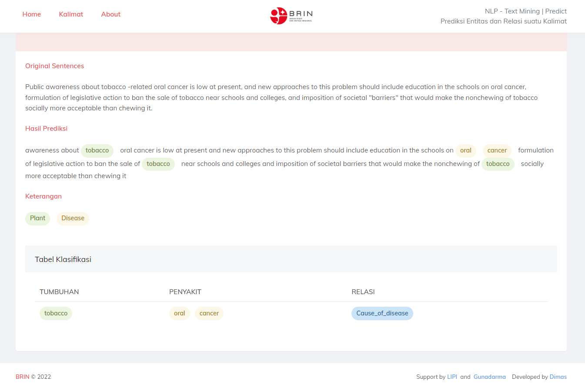

#  **NLP Research**

# **Relation Extraction in Biomedical using BI-LSTM-CRF model + Bert Embedding + Keras + Tensorflow**

##  **`Slamet Riyanto S.Kom., M.M.S.I.`**

##  **`Dimas Dwi Putra`**

## Results


## Architecture


## Dataset


## Visualization


## Eval
| Entities              | precision | recall | f1-score | support | processor | ram  | model | batch size | epochs | length | embedding | Uji | excecution time |
| --------------------- | --------- | ------ | -------- | ------- | --------- | ---- | ----- | ---------- | ------ | ------ | --------- | --- | --------------- |
| Negative              | 0.57      | 0.76   | 0.65     | 118     | cpu       | high | 1     | 8          | 1/100  | 512    | 128       | 7   | 5.15.15         |
| Cause Of Disease      | 0.00      | 0.00   | 0.00     | 37      |           |      |       |            |        |        |           |     |                 |
| Treatment Of Diesease | 0.63      | 0.66   | 0.65     | 98      |           |      |       |            |        |        |           |     |                 |
| Association           | 0.00      | 0.00   | 0.00     | 8       |           |      |       |            |        |        |           |     |                 |
| micro avg             |           |        | 0.59     | 261     |           |      |       |            |        |        |           |     |                 |
| macro avg             | 0.30      | 0.36   | 0.32     | 261     |           |      |       |            |        |        |           |     |                 |
| weighted avg          | 0.49      | 0.59   | 0.54     | 261     |           |      |       |            |        |        |           |     |                 |
| F-1 Scores            |           |        | 59,39%   |         |           |      |       |            |        |        |           |     |                 |
| Negative              | 0.67      | 0.46   | 0.54     | 118     | cpu       | high | 2     | 8          | 2/100  | 512    | 128       | 8   |                 |
| Cause Of Disease      | 0.42      | 0.38   | 0.40     | 37      |           |      |       |            |        |        |           |     |                 |
| Treatment Of Diesease | 0.62      | 0.93   | 0.74     | 98      |           |      |       |            |        |        |           |     |                 |
| Association           | 0.00      | 0.00   | 0.00     | 8       |           |      |       |            |        |        |           |     |                 |
| micro avg             |           |        | 0.61     | 261     |           |      |       |            |        |        |           |     |                 |
| macro avg             | 0.43      | 0.44   | 0.42     | 261     |           |      |       |            |        |        |           |     |                 |
| weighted avg          | 0.59      | 0.61   | 0.58     | 261     |           |      |       |            |        |        |           |     |                 |
| F-1 Scores            |           |        | 60,92%   |         |           |      |       |            |        |        |           |     |                 |
| Negative              | 0.69      | 0.75   | 0.72     | 118     | cpu       | high | 3     | 8          | 3/100  | 512    | 128       | 9   |                 |
| Cause Of Disease      | 0.74      | 0.46   | 0.57     | 37      |           |      |       |            |        |        |           |     |                 |
| Treatment Of Diesease | 0.75      | 0.84   | 0.79     | 98      |           |      |       |            |        |        |           |     |                 |
| Association           | 0.00      | 0.00   | 0.00     | 8       |           |      |       |            |        |        |           |     |                 |
| micro avg             |           |        | 0.72     | 261     |           |      |       |            |        |        |           |     |                 |
| macro avg             | 0.54      | 0.51   | 0.52     | 261     |           |      |       |            |        |        |           |     |                 |
| weighted avg          | 0.70      | 0.72   | 0.70     | 261     |           |      |       |            |        |        |           |     |                 |
| F-1 Scores            |           |        | 71,65%   |         |           |      |       |            |        |        |           |     |                 |
| Negative              | 0.74      | 0.71   | 0.73     | 118     | cpu       | high | 4     | 8          | 7/100  | 512    | 128       | 10  |                 |
| Cause Of Disease      | 0.62      | 0.68   | 0.65     | 37      |           |      |       |            |        |        |           |     |                 |
| Treatment Of Diesease | 0.80      | 0.88   | 0.83     | 98      |           |      |       |            |        |        |           |     |                 |
| Association           | 0.00      | 0.00   | 0.00     | 8       |           |      |       |            |        |        |           |     |                 |
| micro avg             |           |        | 0.75     | 261     |           |      |       |            |        |        |           |     |                 |
| macro avg             | 0.54      | 0.57   | 0.55     | 261     |           |      |       |            |        |        |           |     |                 |
| weighted avg          | 0.72      | 0.75   | 0.73     | 261     |           |      |       |            |        |        |           |     |                 |
| F-1 Scores            |           |        | 74,71%   |         |           |      |       |            |        |        |           |     |                 |
| Negative              | 0.78      | 0.72   | 0.75     | 118     | cpu       | high | 5     | 8          | 11/100 | 512    | 128       | 11  |                 |
| Cause Of Disease      | 0.68      | 0.73   | 0.70     | 37      |           |      |       |            |        |        |           |     |                 |
| Treatment Of Diesease | 0.80      | 0.92   | 0.86     | 98      |           |      |       |            |        |        |           |     |                 |
| Association           | 0.00      | 0.00   | 0.00     | 8       |           |      |       |            |        |        |           |     |                 |
| micro avg             |           |        | 0.77     | 261     |           |      |       |            |        |        |           |     |                 |
| macro avg             | 0.56      | 0.59   | 0.58     | 261     |           |      |       |            |        |        |           |     |                 |
| weighted avg          | 0.75      | 0.77   | 0.76     | 261     |           |      |       |            |        |        |           |     |                 |
| F-1 Scores            |           |        | 77,39%   |         |           |      |       |            |        |        |           |     |                 |
| Negative              | 0.76      | 0.78   | 0.77     | 118     | cpu       | high | 6     | 8          | 71/100 | 512    | 128       | 12  |                 |
| Cause Of Disease      | 0.68      | 0.76   | 0.72     | 37      |           |      |       |            |        |        |           |     |                 |
| Treatment Of Diesease | 0.86      | 0.85   | 0.85     | 98      |           |      |       |            |        |        |           |     |                 |
| Association           | 0.50      | 0.12   | 0.20     | 8       |           |      |       |            |        |        |           |     |                 |
| micro avg             |           |        | 0.78     | 261     |           |      |       |            |        |        |           |     |                 |
| macro avg             | 0.70      | 0.63   | 0.63     | 261     |           |      |       |            |        |        |           |     |                 |
| weighted avg          | 0.78      | 0.78   | 0.78     | 261     |           |      |       |            |        |        |           |     |                 |
| F-1 Scores            |           |        | 78,16%   |         |           |      |       |            |        |        |           |     |                 |

## Predict
```yaml
original: green tea#skin papillomas#Inhibitory effect of green tea on the growth of established skin papillomas in mice.
Predict: Treatment_of_disease
```

# **Other Content**

### **Websites Prediction**
#### [Django Websites Prediction For NER dan RE](https://github.com/Dimas263/Django-Websites_NER_RE)

<br>

### **Named Entity Recognition (NER)**
#### [NLP_NER_Dataset_Biomedical_Plant-Disease_Corpus](https://github.com/Dimas263/NLP_NER_Dataset_Biomedical_Plant-Disease_Corpus)
#### [NLP_NER_CRF_Named_Entity_Recognition](https://github.com/Dimas263/NLP_NER_CRF_Named_Entity_Recognition)
#### [NLP_NER_BILSTM_Named_Entity_Recognition](https://github.com/Dimas263/NLP_NER_BILSTM_Named_Entity_Recognition)
#### [NLP_NER_BERT_Named_Entity_Recognition](https://github.com/Dimas263/NLP_NER_BERT_Named_Entity_Recognition)
#### [NLP_NER_BILSTM_CRF_Named_Entity_Recognition](https://github.com/Dimas263/NLP_NER_BILSTM_CRF_Named_Entity_Recognition)
#### [NLP_NER_BERT_BILSTM_CRF_Named_Entity_Recognition](https://github.com/Dimas263/NLP_NER_BERT_BILSTM_CRF_Named_Entity_Recognition)

<br>

### **Relation Extraction (NER)**
#### [NLP_RE_Dataset_Biomedical_Plant-Disease_Corpus](https://github.com/Dimas263/NLP_RE_Dataset_Biomedical_Plant-Disease_Corpus)
#### [NLP_RE_BERT_Relation_Extraction_Biomedical](https://github.com/Dimas263/NLP_RE_BERT_Relation_Extraction_Biomedical)
#### [NLP_RE_BILSTM_CRF_Relation_Extraction_Biomedical](https://github.com/Dimas263/NLP_RE_BILSTM_CRF_Relation_Extraction_Biomedical)
